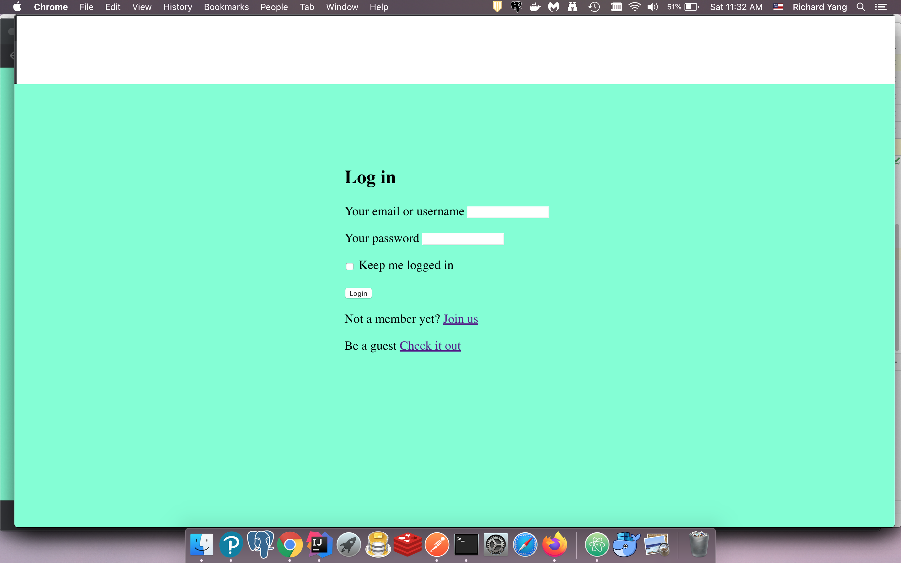
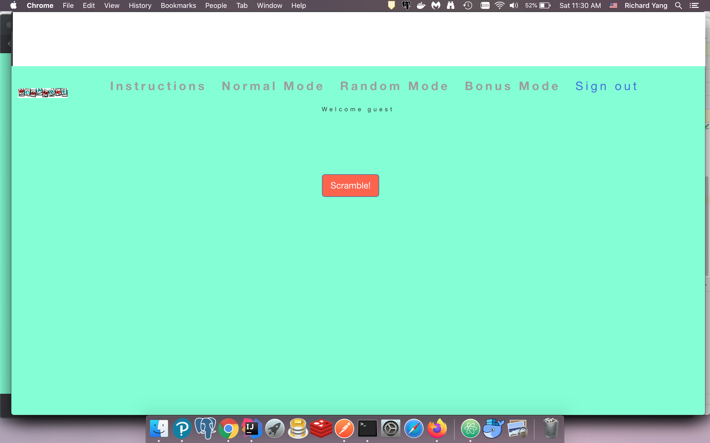

# A Simple Website For A Word Game Called Scramble

##Description
*This website uses a Progres database to store login/signup credentials. Once logged in, a user can play the game in three different modes: normal, random, or bonus. The instructions for the game can be found on the website. Click the big, red scramble button on the middle of the page to start. A timer for one minute is provided, and will activate a soundbite and alert when one minute has passed.

## Installation
* Clone this repo: ``` git clone https://github.com/Rayan20/ScrambleWordGame.git ```
* Install dependencies using [npm](https://www.npmjs.com/) javascript package manager: ``` npm install ```
* Start node server with [nodemon](https://nodemon.io/): ``` nodemon start ```
* Tune to url: ``` http://localhost:3000 ```

## Screenshot



